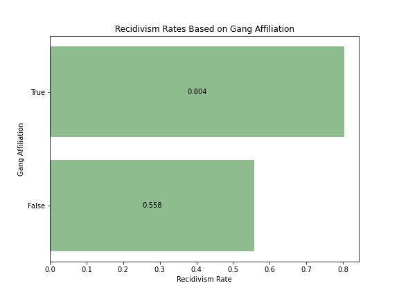

# Group Project 4: Comparing 3 Models for Predicting Recidivism

Authored By:
- [Cynthia Rodriguez](https://github.com/cynthia-rodriguez1)
- [Gabe Mangiante](https://github.com/gmangiante)
- [Dylan Cavaliere](https://github.com/djcavaliere)

**TABLE OF CONTENTS**
 [Executive Summary](#executive-summary)
 [Data Dictionary](#data-dictionaries)
 [Data Acquisition & Cleaning](#data-acquisition-and-cleaning) 
 [EDA](#exploratory-data-analysis)
 [Modeling](#modeling)
 [Results & Recommendations](#results-and-recommendations)

# Executive Summary

**Problem Statement**: We are a team of policy researchers trying to determine if an algorithm can accurately predict whether an inmate will be reincarcerated. We will build and evaluate a series of different classification models to determine what features most predict whether someone will recidivate. 

**Approach & Goal**: Our approach will entail collecting, cleaning, feature engineering, building, tuning, and evaluating a variety of classification models. Models to be considered will include logistic regression, KNN, Decision Trees, Random Forest & Ensemble Models, Naive Bayes and  Neural Networks. Our aim goal is to optimize the accuracy of recidivism classifications. A successful model is one that substantially outperforms the baseline accuracy, ideally at or above 80% accuracy.

**Software Requirements**: Running the analysis in our notebooks will require Pandas, Scikit-Learn, and Tensorflow.

# Data Dictionaries

Due to the combined length of the data dictionaries for the 3 models, they are linked separately here:

- Data dictionary for [Model 1: New York](./data/NY/data_dictionary_NY.md)
- Data dictionary for [Model 2: Florida](./data/FL/data_dictionary_FL.md)
- Data dictionary for [Model 3: Georgia](./data/GA/data_dictionary_GA.md)

# Data Acquisition and Cleaning 
(Notebook is [here](./notebooks/01_data_acq_clean.ipynb))

We identified three datasets from three different states in the US with varying features to be used for modeling. Data was collected from various sources including government websites and Kaggle. Null values were imputed or dropped, please see acquisition and cleaning notebook for detailed steps and logic applied.

Datasets:
 Basic- New York - 188k Observations - 5 basic features including gender, age at release, and county of indictment.

 Criminal History- Florida - 11k Observations - 25 Features relating to the type and frequency of criminal charges of each offender.

 Behavorial- Georgia - 25k Observations - 58 Features relating to various behavorial traits of the individual including gang affiliation, drug use, education level, etc.

# Exploratory Data Analysis 
(Notebook is [here](./notebooks/02_eda.ipynb))

The purpose of this notebook is to "play" with a few aspects of the data, helping us to hone in on the useful columns and identify any problematic data that might cause us problems when modeling. Following are summaries/examples of the explorations conducted:

**Baseline Accuracy**

 Basic Dataset: 58% 
 Criminal History Dataset: 61% 
 Behavorial Dataset: 60% 

**Key Findings** 

Percent Days Employed: We saw a strong negative correlation between recidivism and percent days employed. Those who did not work at all were 71% more likely to recidivate than those who worked all days 

Gang Affiliation & Prior Arrests: Those who are gang affiliated are twice as likely to recidivate as those who are not gang affiliated. Similary we saw a clear upward trend between number of prior arrests and recidivism rates whereby those with fewer priors had lower recidivism rates.

Drug Use: There is a positive correlation between drug use and recidivism whereby those who tested positive for THC, Cocaine, and Meth saw higher rates of recidivism than those who did not test positive.

  

# Modeling 
(Notebook is [here](./notebooks/03_modeling.ipynb))

We built, tuned, and evaluated a variety of classification models across three different datasets from New York, Georgia, and Florida each having different sets of features. 

Basic Dataset- NY- Modeling with only age at release, gender, and county of indictment did not result in sufficient improvement from baseline. Our best performing model was a neural net, from this model we only saw a 2% improvement in accuracy from 58% baseline to 60% test accuracy. 

Behavorial Dataset- Georgia - Modeling with behavorial data saw significant bump in accuracy. We ran 9 different classification models on the dataset with the best performing model being gradient boost which saw an 12% increase from baseline accuracy of 60% to 72% test accuracy.

Criminal History Dataset- Florida - Modeling with criminal history dataset resulted in the highest overall and average accuracy scores. We ran a series of classification models and ultimately a gradient boosting model was the most accurate seeing a 27% improvement from a baseline accuracy of 61% to test accuracy of 88%.

# Results and Recommendations
(Notebook is [here](./notebooks/04_results.ipynb))

**Can we predict recidivism?**
Yes, when given adequate data it is possible to accurately predict recidivism. Our best performing model was a gradient boost utilizing criminal history correctly classify 88% of recidivism, a substantial 27% gain from the baseline accuracy.

**Should we predict recidivism?**
Yes however, we believe that extra caution should be taken when predicting recidivism and certain characteristics that a subject has no control over i.e. age, race, gender etc should not be used for prediction purposes. It is not only more reliable to utilize criminal history rather than these traits but it is also more ethical.

**Policy Recommendations**
 Increase Employment Opportunities
 Focus on Rehabilitation Services
 Target Gang Affiliations to Break Recidivism Cycle
 Increase Access to College and Educational Programs for the Incarcerated

**PRESENTATION**

See [here](./presentation/Recidivism_PDF.pdf) for a brief, fairly non-technical presentation summarizing the problem, modeling process and results.

**DATA SOURCES**
 [NY] https://data.ny.gov/Public-Safety/Recidivism-Beginning-2008/y7pw-wrny
 [FL] https://www.kaggle.com/datasets/danofer/compass
 [GA] https://data.ojp.usdoj.gov/Courts/NIJ-s-Recidivism-Challenge-Full-Dataset/ynf5-u8nk/data

**ADDITIONAL EXTERNAL RESOURCES**
 https://www.kiro7.com/news/local/filthy-rags-outreach-nonprofit-working-fight-crime-through-gang-intervention/CSOUGIMOOFBHRAZWRWJ2QOU4BI/
 https://www.filthyragsoutreach.org/
 https://nationalgangcenter.ojp.gov/insights/44/helping-to-break-the-recidivism-cycle#:~:text=In%20fact%2C%20within%20three%20years,years%2C%2076.6%20percent%20are%20rearrested.&text=This%20is%20most%20often%20true%20of%20gang%20members.
 https://www.semanticscholar.org/paper/Gang-Affiliation-and-Prisoner-Reentry%3A-Variation-in-Pyrooz-Clark/88dc0ee7c37437b89071f07b8942210347769c05
 https://harvardpolitics.com/recidivism-american-progress/
 https://www.researchgate.net/publication/321953443_The_Effects_of_Prison_Labor_on_Institutional_Misconduct_Postprison_Employment_and_Recidivism
 https://econofact.org/can-employment-focused-reentry-programs-keep-former-prisoners-from-being-reincarcerated
 https://www.brookings.edu/research/a-better-path-forward-for-criminal-justice-training-and-employment-for-correctional-populations/
 https://thelastmile.org/about/#story
 https://www.nami.org/Advocacy/Policy-Priorities/Improving-Health/Mental-Health-Treatment-While-Incarcerated
 https://jaapl.org/content/early/2020/02/12/JAAPL.003913-20
